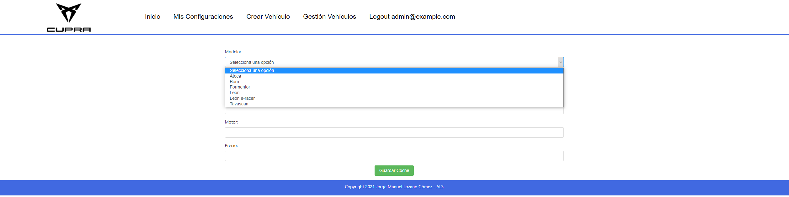

# Proyecto ALS – Concesionario Cupra

## Descripción

El proyecto consiste en una aplicación web falsa de un concesionario de la marca CUPRA.

Dicho concesionario, desde su pagina principal se podrán observar los diversos coches disponibles con sus descripciones básicas (parte inferior de la página), cada coche listado dispone de la opción “Configurar”.

Dicha opción sólo está disponible para los usuarios en este caso también incluye a un usuario administrador.

Una vez logeado, la opción configurar nos redirigirá a una página donde podremos añadirle a ese coche unas extras específicas, esas extras poseen un precio el cual se sumará o restará (al momento) si se marca una extra o se desmarca, mostrando así al final de la configuración el precio total (Precio base + extras).

Posteriormente de haber guardado dicha configuración, estas figurarán en el apartado “Mis configuraciones”.

El usuario podrá crear varias configuraciones, incluyendo varias configuraciones de un mismo coche.
Además, se le da la opción al usuario de modificar cada configuración o de eliminarla.

Por otro lado, el usuario administrador posee las siguientes opciones: Crear Vehículo y Gestión Vehículos.

*Crear Vehículo*: Se presentará un formulario mediante el cual se puede crear un vehículo el cual una vez creado figurará en la página principal.
*Gestión Vehículos*: Se presentará un listado de los coches que hay en ese momento, poseyendo cada uno la opción de modificar sus datos y la opción de eliminar dicho coche.

## Cosas a tener en cuenta: 
*   Los coches creados por el usuario administrador solo poseen los datos básicos (sin extras). Una vez creada una configuración sobre dicho coche se generan unas extras alas que se le asocia el coche y una configuración la cual asocia esas extras al usuario que este creando la configuración.

*   Cada usuario posee sus propias configuraciones, por lo que no hay conflictos si dos usuarios hacen una configuración sobre el mismo coche.

*   Si no hay coches disponibles no se mostrará el carrousel ya que sería una carrousel vacío, en el caso de haber menos de 3 coches se mostrarán placeholders para permitir el correcto funcionamiento del carrousel.

*   Tanto el precio del coche como el precio total (coche + extras), se almacenan como Float, pero se muestran como int (por motivos estilísticos).

*   Si se borra un coche sobre el cual algún usuario ha realizado una configuración, estas se borrarán.

# Previews

### Front-Page

### Configurando vehículo /Modificando Configuración

### Crear vehículo

### Gestión de vehículos

